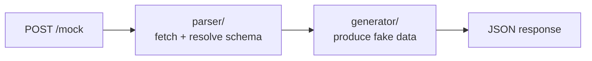

# Mocker

A FastAPI service that generates realistic, schema-valid mock data from internal FastAPI endpoints. Point your tests at Mocker instead of the real service — no test code changes required.

## Architecture



## The Problem

Writing mock fixtures by hand is tedious and drifts from the real schema over time. Mocker reads the OpenAPI schema directly from your service and generates realistic fake responses automatically.

**Before** — your tests call the real service (or you maintain hand-rolled mocks):
```python
response = httpx.get("http://user-service/users/abc-123")
```

**After** — point `BASE_URL` at Mocker. No other changes:
```python
response = httpx.get("http://localhost:8080/mock")  # returns fake but schema-valid data
```

## Getting Started

```bash
make install      # install dependencies
make run          # start the API (port 8080)
make run-reload   # start with auto-reload (dev)

# Docker
make docker-build  # build image tagged mocker:<git-sha>
make docker-run    # run container on port 8080

# Helm / Helmfile
make helm-dev         # deploy to development
make helm-staging     # deploy to staging
make helm-production  # deploy to production
make helm-diff ENV=staging     # dry-run diff
make helm-destroy ENV=staging  # tear down a release
```

## Endpoints

|Endpoint|Method|Description|
|--------|------|-----------|
|`/mock/schema`|`POST`|Generate mock data from an OpenAPI schema URL or registered app name|
|`/mock/sample`|`POST`|Regenerate fake data from a caller-provided response dict|
|`/health`|`GET`|Service health — `{"status": "ok"}`|
|`/healthz`|`GET`|Kubernetes liveness probe — `{}`|
|`/ready`|`GET`|Kubernetes readiness probe — `{}`|

## Transparent path routing

The fastest way to adopt Mocker: replace only the base URL in your tests. Register your service in `APP_REGISTRY` and swap the host — no other code changes required.

```bash
# Before
curl https://myservice.internal/users/abc-123

# After — only the host changes
curl https://mocker.internal/myservice/users/abc-123
```

Mocker extracts `myservice` from the first path segment, looks it up in `APP_REGISTRY`, fetches its OpenAPI schema, matches `/users/abc-123` to the closest path template (e.g. `/users/{id}`), and returns a schema-valid mock response with the correct status code.

All HTTP methods are supported (`GET`, `POST`, `PUT`, `PATCH`, `DELETE`). Path parameters with real values (e.g. `/users/abc-123`) are automatically matched to their schema templates (e.g. `/users/{id}`).

An unknown `app_name` returns HTTP 422 with a structured error.

---

## Usage

Use `schema_url` to point at any OpenAPI schema, or `app_name` for a registered well-known service. If both are given, `schema_url` wins.

```bash
# by schema URL
POST /mock/schema
Content-Type: application/json

{
  "schema_url": "http://user-service/openapi.json",
  "endpoint": "/users/{id}",
  "method": "GET"
}

# by app name (resolves to registered schema URL)
POST /mock/schema
Content-Type: application/json

{
  "app_name": "user-service",
  "endpoint": "/users/{id}",
  "method": "GET"
}
```

**Response:**
```json
{
  "data": {
    "id": "a3f2c1d0-...",
    "name": "Jane Smith",
    "email": "jane.smith@example.com",
    "region": "EMEA",
    "status": "active",
    "owner": {
      "name": "Jane Smith",
      "email": "jane.smith@example.com"
    }
  },
  "status_code": 200,
  "mocked_from": "http://user-service/openapi.json"
}
```

`data` is a `dict` for object-returning endpoints and a `list` for array-returning endpoints — it mirrors the actual schema shape.

Mocker fetches the OpenAPI schema from `schema_url`, resolves all `$ref` pointers, and returns a fake but structurally valid response for the requested endpoint and method.

### Response overrides

Pass an `overrides` dict to echo specific values back in the response. Any key that matches a top-level field in the generated response is replaced with the provided value — unknown keys are silently ignored, and overrides are skipped entirely when the response is a list.

This is useful when a test asserts on a specific field (e.g. the username you just sent in a create-user request):

```bash
POST /mock/schema
Content-Type: application/json

{
  "schema_url": "http://user-service/openapi.json",
  "endpoint": "/users",
  "method": "POST",
  "overrides": {
    "username": "d11111",
    "region": "EMEA"
  }
}
```

The response `data` will contain `"username": "d11111"` and `"region": "EMEA"` — all other fields are still randomly generated from the schema.

### Schema-driven status codes

The `status_code` in the response comes directly from the schema, not from a hardcoded `200`. If the endpoint's first `2xx` response is `201`, the mock returns `"status_code": 201`. This means create-resource endpoints get the right status code automatically.

Field values are generated with the following priority:
1. **Enum** — if the schema defines allowed values, one is picked at random (works with inline enums and FastAPI's nullable `anyOf` pattern)
2. **Custom hints** — team-defined value lists loaded from a YAML file (set `MOCKER_CUSTOM_HINTS_PATH`)
3. **Semantic hints** — field names like `email`, `iban`, `name`, `region` produce realistic values via Faker
4. **Type-based** — fallback generation for `string`, `integer`, `number`, `boolean`, `array`, `object`

### Custom hints

Copy `custom_hints.example.yaml`, add your domain values, and point Mocker at it:

```bash
MOCKER_CUSTOM_HINTS_PATH=/path/to/custom_hints.yaml
```

```yaml
# global — applied to all apps
status:
  - active
  - inactive
  - pending

# per-app overrides — app wins over global for the same pattern
apps:
  payment-gateway:
    status:
      - processing
      - settled
      - failed
  order-service:
    status:
      - placed
      - shipped
      - delivered
```

Any field whose name contains the pattern (case-insensitive substring) will pick a random value from the list. When calling `/mock/schema` with an `app_name`, app-specific hints are merged on top of the global ones. Custom hints override built-in Faker hints. `apps` is a reserved key and never matches a field name.

**Kubernetes / Helm:** set `customHints.enabled: true` and provide the file content inline in your env's values file — the chart renders it into a ConfigMap, mounts it, and sets `MOCKER_CUSTOM_HINTS_PATH` automatically:

```yaml
# deploy/values/development.yaml
customHints:
  enabled: true
  content: |
    status:
      - active
      - inactive
    apps:
      payment-gateway:
        status:
          - processing
          - settled
```

## Running Tests

```bash
make test

# Single file
uv run pytest tests/unit/parser/test_parser.py

# Single test
uv run pytest -k "test_parse_route_returns_route_definition"
```

## Roadmap

- [x] Phase 1 — Parser: fetch OpenAPI schema, resolve `$ref`s, extract `RouteDefinition`
- [x] Phase 2 — Generator: walk `RouteDefinition` and produce fake data (Faker + semantic hints for `email`, `iban`, `region`, `ecosystem`, etc.)
- [x] Phase 3 — API: `POST /mock` endpoint wiring parser + generator
- [x] Phase 3.5 — Health endpoints: `GET /health`, `GET /healthz`, `GET /ready`
- [x] Phase 4 — Schema caching: `@lru_cache` on `fetch_schema`, `TestSettings` as test constant source
- [x] Phase 5 — Dockerize: multi-stage `Dockerfile` + `.dockerignore` + `make docker-build/run`
- [x] Phase 6 — Helm + Helmfile: `deploy/` chart (`Deployment`, `Service`, `ConfigMap`, `Ingress`); Helmfile for dev/staging/production overlays; `COMMIT_SHA` flows from Makefile to image tag
- [x] Phase 7 — Sample-based mocking: `POST /mock/sample` accepts a real response dict and regenerates fake data from its shape; `POST /mock` renamed to `POST /mock/schema`
- [x] Phase 7.5 — Overrides + schema-driven status codes: optional `overrides` dict echoes caller-provided values back into the response; `status_code` is read from the schema (first `2xx`) instead of hardcoded `200`
- [x] Phase 8 — Transparent path routing: `GET /myservice/users/123` → mock without changing test code beyond the base URL
- [ ] Phase 9 — Service catalog + pre-generated mock store: background worker fetches schemas and pre-generates mock data for registered services into a DB; `app_name + endpoint + method` becomes a DB lookup (replaces static `APP_REGISTRY`); live `schema_url` path remains for ad-hoc use
