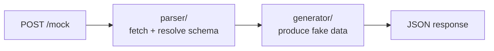

# Mocker

A FastAPI service that generates realistic, schema-valid mock data from internal FastAPI endpoints. Point your tests at Mocker instead of the real service — no test code changes required.

## Architecture



## The Problem

Writing mock fixtures by hand is tedious and drifts from the real schema over time. Mocker reads the OpenAPI schema directly from your service and generates realistic fake responses automatically.

**Before** — your tests call the real service (or you maintain hand-rolled mocks):
```python
response = httpx.get("http://service-registry/services/abc-123")
```

**After** — point `BASE_URL` at Mocker. No other changes:
```python
response = httpx.get("http://localhost:8080/mock")  # returns fake but schema-valid data
```

## Getting Started

```bash
make install      # install dependencies
make run          # start the API (port 8080)
make run-reload   # start with auto-reload (dev)

# Docker
make docker-build  # build image (mocker:local)
make docker-run    # run container on port 8080
```

## Endpoints

|Endpoint|Method|Description|
|--------|------|-----------|
|`/mock`|`POST`|Generate mock data from an OpenAPI schema|
|`/health`|`GET`|Service health — `{"status": "ok"}`|
|`/healthz`|`GET`|Kubernetes liveness probe — `{}`|
|`/ready`|`GET`|Kubernetes readiness probe — `{}`|

## Usage

```bash
POST /mock
Content-Type: application/json

{
  "schema_url": "http://service-registry/openapi.json",
  "endpoint": "/services/{id}",
  "method": "GET"
}
```

**Response:**
```json
{
  "data": {
    "id": "a3f2c1d0-...",
    "name": "trading-gateway",
    "team_email": "platform-core@internal.example.com",
    "region": "EMEA",
    "ecosystem": "TRADECORE",
    "status": "active",
    "owner": {
      "name": "Alice Martin",
      "email": "alice.martin@internal.example.com"
    }
  },
  "status_code": 200,
  "mocked_from": "http://service-registry/openapi.json"
}
```

Mocker fetches the OpenAPI schema from `schema_url`, resolves all `$ref` pointers, and returns a fake but structurally valid response for the requested endpoint and method.

## Running Tests

```bash
make test

# Single file
uv run pytest tests/unit/parser/test_parser.py

# Single test
uv run pytest -k "test_parse_route_returns_route_definition"
```

## Roadmap

- [x] Phase 1 — Parser: fetch OpenAPI schema, resolve `$ref`s, extract `RouteDefinition`
- [x] Phase 2 — Generator: walk `RouteDefinition` and produce fake data (Faker + semantic hints for `email`, `iban`, `region`, `ecosystem`, etc.)
- [x] Phase 3 — API: `POST /mock` endpoint wiring parser + generator
- [x] Phase 3.5 — Health endpoints: `GET /health`, `GET /healthz`, `GET /ready`
- [x] Phase 4 — Schema caching: `@lru_cache` on `fetch_schema`, `TestSettings` as test constant source
- [ ] Phase 5 — Dockerize: multi-stage `Dockerfile` + `.dockerignore` + `make docker-build/run`
- [ ] Phase 6 — Helm + Helmfile: chart with `Deployment`, `Service`, `ConfigMap`; Helmfile for env overlays
- [ ] Phase 7 — Stub server: mirror all routes from a target service (drop-in replacement mode)
